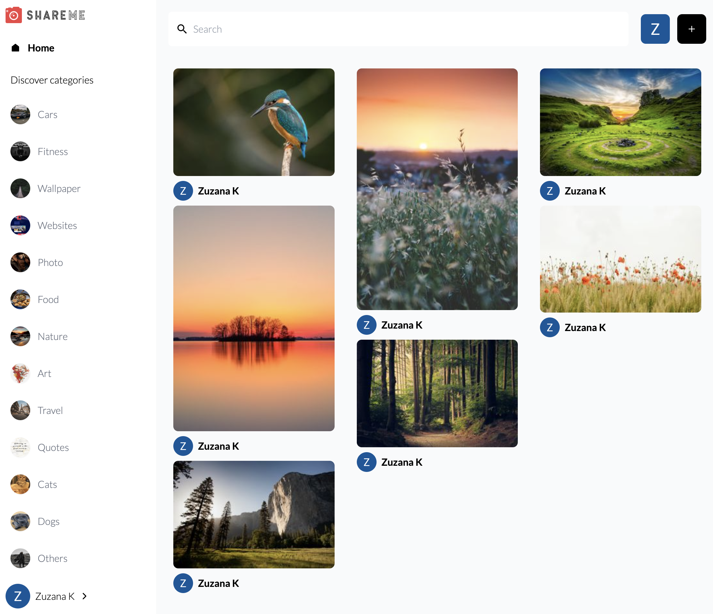
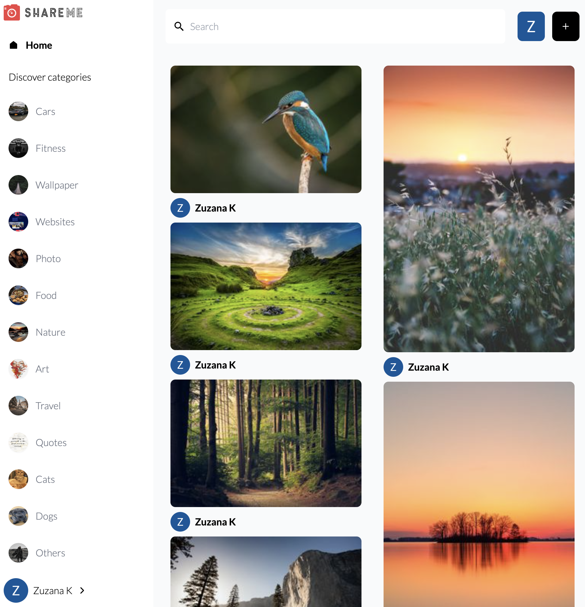

 

## About
ShareMe is a social media image sharing app that supports adding new images, tagging images, downloading/saving favorite images, leaving comments on images, and searching through images.

 

 

The aim of this project was to learn [ReactJS](https://reactjs.org/). It follows this [tutorial](https://www.youtube.com/watch?v=XxXyfkrP298&t=13s) by [JavaScript Mastery](https://twitter.com/jsmasterypro). Some aspect of the tutorial were outdated and required independent work. 

The frontend is built with React and [TailwindCSS](https://tailwindcss.com/) and uses a [Google Login](https://www.npmjs.com/package/@react-oauth/google) package to authenticate the user with their Google credentials.

The view is responsive and it is using the masonry layout.

 

 

User can comment on images:

 

 

The user can also save images to their Saved Pins.

 

 

The backend is using [Sanity.io](https://www.sanity.io/), a platform for structured content which helps to create a full stack app with a nice backend interface.

However, the second iteration of this project will use [Laravel](https://www.laravel.com) to implement the API.

## Issues
There is a known issue where it takes some time for new and updated content to show up on the page. This will be investigated and fixed in the second iteration.

## Testing
There are not tests as of now but I will be write tests using the [Jest](https://www.jest.io) library when I re-do the project to use API built in Laravel.

## Author
Zuzana Kunckova
